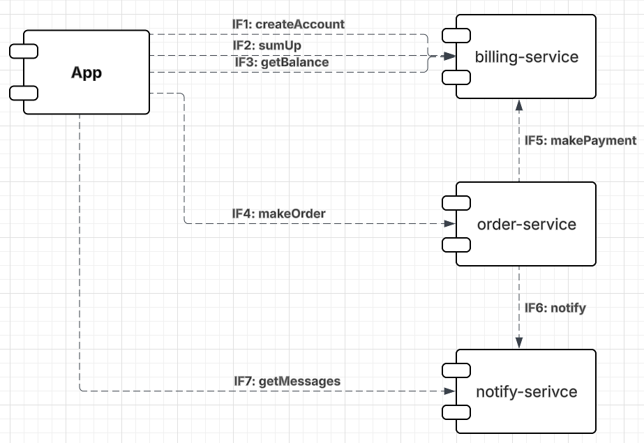

# otus-restful-chart
# Информационные потоки


Все потоки идут через rest кроме IF6: notify (kafka).

### Папки репозитория otus-restful-chart
- /billing-service - java service folder
- /order-service - java service folder
- /notify-service - java service folder
- /order-chart - uber chart, содержащий другие чарты
- /dev/docker-compose (kafka, db) для отладки сервисов до kuber

### OpenApi
Созданы openApi.yaml файлы для описания взаимодействия.
- /billing-service/billing-service-rest-api.yaml
- /notify-service/notify-service-kafka-api.yaml (asyncApi для )
- /notify-service/notify-service-rest-api.yaml
- /order-service/src/main/resources/order-service-rest-api.yaml

#### заметки реализации (disclaimer)
- Несмотря, что добавлена postgresql в helm, она не используется
- Вместо бд реализация in-memory сервиса с вытекающими ограничениями 1 pod per service. 
Не стал делать, исключительно, чтобы сэкономить время. Отработал настройку бд в helm, liquibase в прошлой ДЗ.
- kafka используется, настроено plaintext security в parent-helm-values. 
- Решил, сделать кафку, чтобы разобраться на будущее, как использовать bitnami kafka chart в helm и по смыслу для
notify это уместно.

#### запуск в minikube (ingress addon enabled)
```shell
helm install order-sys ./order-chart
```

#### тесты постмана, которые прогоняют сценарий:

- Создать пользователя. Должен создаться аккаунт в биллинге. 
- Положить деньги на счет пользователя через сервис биллинга.
- Сделать заказ, на который хватает денег.
- Посмотреть деньги на счету пользователя и убедиться, что их сняли.
- Посмотреть в сервисе нотификаций отправленные сообщения и убедиться, что сообщение отправилось
- Сделать заказ, на который не хватает денег.
- Посмотреть деньги на счету пользователя и убедиться, что их количество не поменялось.
- Посмотреть в сервисе нотификаций отправленные сообщения и убедиться, что сообщение отправилось.

Сценарий реализован в postman в открытой коллекции:
https://www.postman.com/maxmiracle/workspace/otus-user-service-test/collection/18992670-9d844810-0cd6-4550-a890-aa19c06f7f3d?action=share&creator=18992670


## Сборка сервисов 
- (не требуется для запуска, так как нужные сервисы загружены в docker hub)
##### billing-service
```shell
mvn package -f ./billing-service/pom.xml
```

```shell
docker build --platform linux/amd64 -t maxmiracle/billing-service:4 ./billing-service
```

Опубликовать
```shell
docker push maxmiracle/billing-service:4
```

##### order-service
```shell
mvn clean package -f ./order-service/pom.xml
```
```shell
docker build --platform linux/amd64 -t maxmiracle/order-service:6 ./order-service
```
Опубликовать
```shell
docker push maxmiracle/order-service:6
```

##### notify-service
```shell
mvn clean package -f ./notify-service/pom.xml
```
```shell
docker build --platform linux/amd64 -t maxmiracle/notify-service:1 ./notify-service
```
Опубликовать
```shell
docker push maxmiracle/notify-service:1
```

##### Не забудь включить ingress addon в minikube
```shell
minikube addons enable ingress
```

##### Проверка инсталяции хелма, миникуб должен быть запущен, чтобы сверить параметры
```shell
helm install order-sys ./order-chart --dry-run --debug
```

Установка сервиса в миникуб через helm
```shell
helm install order-sys ./order-chart
```

```shell
helm uninstall order-sys
```
```shell
helm upgrade order-sys ./order-chart
```